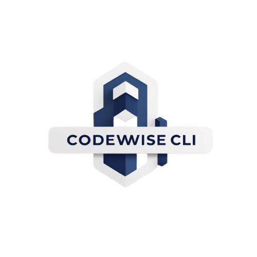

# Codewise CLI

<div align="center">
  
</div>

<br/>


Codewise is a DevOps-oriented command-line utility for scaffolding, packaging, and deploying containerized applications using a consistent workflow. It enables developers and platform engineers to move from source code to running workloads using Docker, Kubernetes, and Helm without switching tools or remembering boilerplate syntax.

---

## Features

Codewise provides automation for:

- Dockerfile scaffolding and image builds
- Kubernetes manifest generation and deployment
- Helm chart scaffolding
- Namespace, context, and dry-run support for Kubernetes operations
- Configuration bootstrapping for defaults (image, namespace, repo)
- File encoding utilities (Base64, YAML ⇄ JSON, ENV parsing)
- Templating & project bootstrap helpers

---

## Installation

Clone the repository:

```bash
git clone https://github.com/aryansharma9917/codewise-cli.git
cd codewise-cli
```

Build from source:

```bash
make build
# or
go build -o codewise-cli main.go
```

(Optional) install globally:

```bash
sudo mv codewise-cli /usr/local/bin/codewise
```

---

## Usage

General syntax:

```bash
codewise <command> [subcommand] [flags]
```

Local development usage (without global install):

```bash
./codewise-cli <command> [subcommand] [flags]
# or
go run . <command> [subcommand] [flags]
```

---

## Documentation

- [Testing runbook](TESTING_RUNBOOK.md) for copy-paste test and smoke commands
- [Project overview](PROJECT_OVERVIEW.md) for architecture, connectivity, build flow, and tech stack
- [Deployment maturity ladder](DEPLOYMENT_MATURITY.md) for local -> staging -> production readiness criteria

---

## Configuration

Initialize a personal configuration:

```bash
codewise config init
```

This creates:

```
~/.codewise/config.yaml
```

example:

```yaml
defaults:
  app_name: myapp
  image: codewise:latest
  namespace: default
  context: ""
```

Configuration values can be overridden with CLI flags.

---

## Docker Workflow

Initialize a Dockerfile:

```bash
codewise docker init
```

Validate Dockerfile structure:

```bash
codewise docker validate
```

Build container image:

```bash
codewise docker build
```

---

## Kubernetes Workflow

Initialize manifests:

```bash
codewise k8s init
```

Apply manifests to a cluster:

```bash
codewise k8s apply --namespace dev --context minikube
```

Dry-run mode (no cluster required):

```bash
codewise k8s apply --dry-run
```

Delete deployment:

```bash
codewise k8s delete --namespace dev
```

---

## Helm Workflow

Scaffold a Helm chart:

```bash
codewise helm init
```

This creates:

```
helm/chart/
├── Chart.yaml
├── values.yaml
└── templates/
    ├── deployment.yaml
    └── service.yaml
```

---

## Encoding & Conversion Utilities

Usage:

```bash
codewise encode --input file --output out [flags]
```

Common conversions:

| command example | description |
| --------------- | ----------- |
| `codewise encode -i app.json -o app.yaml --json-to-yaml` | JSON → YAML |
| `codewise encode -i app.yaml -o app.json` | YAML → JSON (default path) |
| `codewise encode -i .env -o env.json --env-to-json` | .env → JSON |
| `codewise encode -i input.txt -o encoded.txt --base64` | Base64 encode |
| `codewise encode -i encoded.txt -o output.txt --base64 --decode` | Base64 decode |

Additional auto-detected conversions are supported from file extensions:

- TOML ⇄ JSON
- XML ⇄ JSON

---

## Example End-to-End Workflow

```bash
codewise config init
codewise docker init
codewise docker build
codewise k8s init
codewise k8s apply --namespace dev --context minikube
codewise helm init
```

---

## Project Structure

```
.
├── cmd/               # CLI commands
├── pkg/               # Core logic (docker, k8s, helm, config, encode)
├── templates/         # Source templates used by generators
├── helm/              # Generated Helm charts
├── k8s/               # Generated Kubernetes manifests
├── tests/             # Automated tests
├── testdata/          # Fixtures used by tests and conversion checks
├── Dockerfile
├── go.mod
└── main.go
```

---

## Roadmap

Planned enhancements include:

* Helm install/upgrade operations
* Helm push to OCI registries
* GitOps integration (ArgoCD / Flux)
* CI/CD pipeline generation (GitHub Actions)
* Image scanning (Trivy/Syft plugins)
* Terraform infrastructure modules
* Local cluster provisioning (kind/k3d/minikube)
* Plugin system for custom extensions
* Global binary installation via Homebrew/Scoop

---

## Contributing

Contributions are welcome. The project follows a logical commit layering:

* Logic changes under `pkg/`
* CLI wiring under `cmd/`
* Scaffold output under `k8s/` and `helm/`

Fork, branch, commit, and open a PR.

